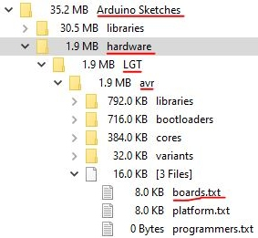
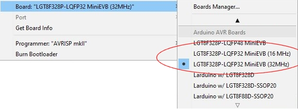
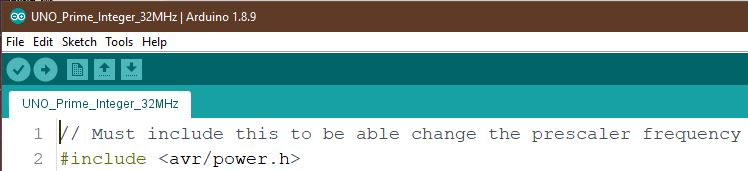
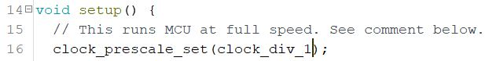
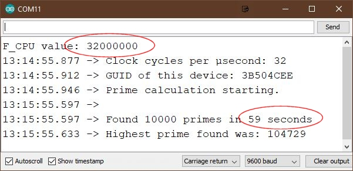
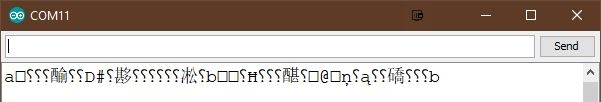

# LGT8F328P Arduino Clone Chip ATMega328P
#### An improved ATMega328P with this cheap clone Logic Green LGT8F328P

#### $8 off your first order at LCSC Electronics with https://lcsc.com/?href=ralphsbacon&source=referral  

## See https://www.youtube.com/ralphbacon video #156
#### (Direct link to video: https://youtu.be/Myfeqrl3QP0)

**Click on any image to see the full-sized version in a new tab.**  
**Links to *all products* at the bottom of this description**

**So we're looking at the 32MHz Nano-sized drop-in replacement** but I'm using a different sized development board just for ease of use in the video. My device looks like this (and well worth it for experimenting with)  

But the final device is Nano sized, and a drop-in pin replacement  

Or you can have a Pro-Micro sized device that will require a USB-to-Serial adapter to program.  

The 6 simple steps to get a LGT8F328P-based board running at 32MHz are listed on my GitHub.
https://github.com/RalphBacon/LGT8F328P-Arduino-Clone-Chip-ATMega328P

## 6 Simple Steps to get a LGT8F328P-based board running at 32MHz

**1 Download the LogicGreen zipped resources here**  
https://github.com/LGTMCU/Larduino_HSP  
There's a copy of this zipped folder right here on my GitHub

**2 Extract the download (unzip it)**  
and move the unzipped LGT/avr folder to under the *hardware* folder in your Arduino sketch folder. If you do not have a _hardware_ folder in your Arduino Sketches folder, just create one.

Your structure should look like this:  

**3 Replace the boards.txt**  
In the Hardware -> LGT -> AVR folder **delete the boards.txt**.  
Then copy the boards.txt in this GitHub there in place of the one you just deleted.

### Testing

**4 Fire up the Arduino IDE (or restart it if already running)**    

**5 Select the right board**  
Go to Tools, Board and scroll down until you see the next set of LGT8F boards, one of which will be 32MHz variant you just added. The original LGT8F328P board will now be described as (16MHz)  

Remember, in your future sketches, always add in the #include for the <avr/power.h> as shown in the video.  
  

Finally, add in this statement before anything else in the setup().  
  

**6 Load the Prime Numer Test sketch**
from this GitHub, build and run.  

In the Serial Monitor window you should see this:  
  

If you get this instead (and your Serial Monitor is set to the correct speed)  
  
then your board might not be running at 32MHz. Is your Serial Monitor speed set to 9600? Did you select the 32MHz variant of the board? Did you restart your Arduino IDE after replacing the *boards.txt* file? Did you put the unzipped folder under the correct *hardware* folder in the *Arduino Sketches*?

### What's this GUID then?  
Each **LGT8F328P** has a unique GUID (serial number) built in. Useful for encrypting things.  
To retrieve the number (it's read-only) do this in your sketch setup():  
*uint32_t guid = *(uint32_t*)&GUID0;*

To display that number in its intended **HEX format** do this:  
*Serial.println(guid, HEX);*  

Simples, right?

### Breaking news!  
David Buezas has written an entire boards description for all frequencies **and** it allows us to dispense with setting the clock prescaler.  

See https://github.com/dbuezas/lgt8fx for full details.  

## LINKS     LINKS     LINKS     LINKS  

An excellent source of **English datasheets and documentation by Andrew Watterott**  
https://github.com/watterott/LGT8F328P-Testing  

**KEYES Open Source LGT8F328P Control Module Development Board**  
https://www.banggood.com/KEYES-Open-Source-LGT8F328P-Control-Module-Development-Board-For-Arduino-p-1400916.html?p=FQ040729393382015118&utm_campaign=25129675&utm_content=3897  

**AliExpress Nano/pro Micro replacements**  
LGT8F328P LQFP32 replaces NANO V3.0 HT42B534 chip  
http://s.click.aliexpress.com/e/cEAUGf6s  
This seller has both variants (SOP20 & LQFP32) but look around there are other sellers too!  

**Logic Green's GitHub for the support files (also on my GitHub)**  
https://github.com/LGTMCU/Larduino_HSP

**LGT8F328P Schematic (also copy on my GitHub)**  
https://www.electrodragon.com/w/images/a/ac/SN0124_LARDUINO_UNO_V2_20140613.jpg  

**Chinese Documentation for what it's worth**  
http://www.logicgreen.io/upload/lgt8fx8p/LGT8FX8P_databook_v1.0.4.pdf
English version of similar family of chips on my GitHub  

**Top 10,000 Prime Numbers**  
https://www.di-mgt.com.au/primes10000.txt

If you like this video please give it a thumbs up, share it and if you're not already subscribed please consider doing so and joining me on my Arduinite journey

My channel and blog are here:  
\------------------------------------------------------------------  
https://www.youtube.com/RalphBacon  
https://ralphbacon.blog  
\------------------------------------------------------------------
